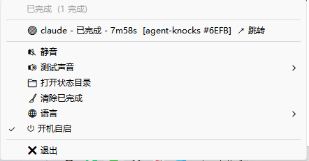

# Agent Knocks · agent 状态灯

[English](README.md) | **中文**

一个极简的 Windows 托盘状态灯，用于盯着 **AI 编码 agent**（Claude Code / Codex / pi）。
agent 需要你或干完活时，它会"敲门"——变色 + 声音 + 气泡，**点一下就跳到那个 agent 的窗口**。
原生 **Rust** 单 EXE（约 0.45 MB，常驻 ~10 MB），零运行时依赖。

<p align="center">
  <br>
  <sub>🟢 已完成 ｜ 🔵 处理中 ｜ 🟠 等待确认</sub>
</p>
<p align="center">
  <br>
  <sub>右键：每个会话的状态 / 耗时 / 项目 · ↗ 跳转 · 静音 · 测试声音 · 语言 · 开机自启</sub>
</p>

> 原 C# / .NET 版已归档在 [`legacy/csharp/`](legacy/csharp/) 与 [`csharp-final`](https://github.com/mazjq/agent-knocks/releases/tag/csharp-final) release。

## 功能

| 状态 | 颜色 | 声音 |
|---|---|---|
| 🔵 处理中 — agent 正在干活 | 蓝 | 无 |
| 🟠 等待确认 — 在等你输入/批准 | 橙 | 上升音 660→990Hz + 气泡 |
| 🟢 已完成 — 这轮干完了 | 绿 | 上行三连 770→1046→1318Hz + 气泡 |
| ⚪ 空闲 — 无活动会话 | 灰 | 无 |

- **一瞥即知的三态彩点**，聚合所有会话（等待 > 处理 > 完成 > 空闲）；右键看每个会话明细。
- **直觉化声音 + Windows 气泡**（等待/完成时，可静音）。
- **点击跳转** — 左键点彩点（或菜单里的会话行）把那个 agent 的窗口拉到最前；按**项目/cwd 文件夹名**匹配，**多个 VSCode 窗口也能区分**。
- **多会话** — 每个窗口按 `session_id` 区分，带短标签 `#tag`。
- **中英双语** — 托盘菜单切换（默认英文）。
- **完成态保留** 到你关闭终端（`SessionEnd`），并有 30 分钟兜底 + "清除已完成"。
- **非阻塞 & 安全** — hook 只写一个状态文件就退出（不输出、退出码 0），绝不干扰 agent；装/卸只动自己加的 hook。

## 安装

**最简单（免工具链）**：下载 [最新 release](https://github.com/mazjq/agent-knocks/releases/latest) 的 zip → 解压 → 双击 **`install.cmd`**。卸载：`uninstall.cmd`。

**从源码装**（需 [Rust 工具链](https://rustup.rs)）：
```
git clone https://github.com/mazjq/agent-knocks && cd agent-knocks && install.cmd
```

安装会部署到 `%LOCALAPPDATA%\AgentKnocks\`，把 Claude hook 合并进 `~/.claude/settings.json`（先备份）+
写 Codex 的 `~/.codex/hooks.json`（不碰你的 `notify`），建开始菜单快捷方式 + 开机自启，并启动托盘。
**装完重启正在跑的 Claude/Codex 会话**让 hook 生效。参数：`-NoStart` / `-NoAutoStart` / `-NoClaude` / `-NoCodex`。

hook → 状态：`UserPromptSubmit`/`PreToolUse`/`PostToolUse` → 处理中 · `PermissionRequest` → 等待 ·
`Stop` → 完成 · `SessionEnd` → 移除。

## 开发

```powershell
cargo test               # 核心状态机测试（16 个）
cargo build --release    # target\release\agentknocks.exe（GUI 子系统，无控制台）
.\install.ps1            # 编译 + 重部署 + 重启托盘
.\package.ps1            # 打便携 zip 到 dist\
```
纯逻辑都在 `src/core.rs`（无 UI 依赖、全单测）。TDD：先在它的 `#[cfg(test)] mod tests` 加用例、跑绿，再改实现。
界面文案是 `src/tray.rs` 里的 `t_*` 函数。

## 架构

hook 驱动、三段式、不轮询：

```
 ① agent hook                 ② 状态文件 = 事件总线                 ③ 常驻托盘
 claude/codex ─emit─► %LOCALAPPDATA%\AgentKnocks\state\<agent>__<会话>.json
              (旁观:不输出/退出码0)               ─► notify 监听 → 聚合 → 变色 + 声音 + 气泡
```

- **`src/core.rs`** — 纯状态机：优先级、JSON 解析、聚合、过期淘汰、跃迁发声、`select_window`（聚焦目标选择）。跨平台、单测覆盖。
- **`src/app.rs`** — 引擎：`notify` 文件监听 + ≤2s 淘汰循环；写 `status.json`（聚合态，供外部读取）。
- **`src/main.rs`** — `--emit`（旁观；捕获 agent 的 cwd + 窗口句柄）/ 托盘 / `--once`。
- **`src/tray.rs`** — Windows 托盘 UI：彩点 + 菜单 + 声音 + 气泡 + i18n + 自启 + 点击跳转（Win32）。

**任何东西都能驱动它**（hook 契约）：
```
AgentKnocks.exe --emit --agent <名> --status <processing|waiting|done|end> [--key <会话id>] [--title <显示名>]
```
或把 hook 的 JSON 从 stdin 管道喂入。外部工具可直接读 `state\*.json` / `status.json`。

## 限制

- 仅 Windows——`core.rs`/`app.rs` 已跨平台，macOS/Linux 托盘在[路线图 (#1)](https://github.com/mazjq/agent-knocks/issues/1)。
- Codex **桌面 app** 暂不派发本地 hook（[openai/codex#16430](https://github.com/openai/codex/issues/16430)）→ `hooks.json` 已就位，或用 Codex CLI。
- 多个 agent 挤在**同一个** VSCode 窗口的终端里 → 只能把窗口拉到前面，没法切到具体终端 tab。
