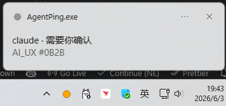
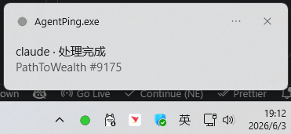
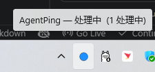
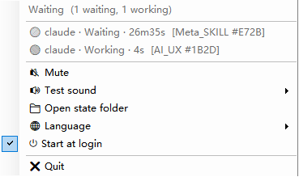

# Agent 状态灯 · Agent Knocks

[English](README.md) | **中文**

后台监控 **claude / codex / pi 等 agent** 的工作状态，托盘变色 + 直觉化声音 + 气泡提示。
原生单 EXE，零运行时依赖，常驻内存约 **23MB**。仅 Windows（跨平台 Rust 重写在路线图上）。

| 状态 | 含义 | 颜色 | 声音 |
|---|---|---|---|
| 🔵 处理中 | agent 正在干活 | 蓝 | 无 |
| 🟠 等待确认 | agent 在等你输入/批准 | 橙 | 上升音 660→990Hz（像在问"在吗？"）+ 气泡 |
| 🟢 已完成 | agent 处理完成 | 绿 | 上行三连 770→1046→1318Hz（"搞定~"）+ 气泡 |
| ⚪ 空闲 | 无活动会话 | 灰 | 无 |

托盘显示所有会话里**优先级最高**的状态（等待 > 处理 > 完成 > 空闲）；右键菜单看每个会话明细。
多窗口按 `session_id` 区分，同项目多开带短标签 `#XXXX`。

> **语言**：托盘界面**默认英文**，可随时在托盘菜单 → 🌐 Language 切换到**中文**。

## 效果

<p align="center">
  <br>
  <sub>三态托盘彩灯：🟢 已完成 ｜ 🔵 处理中 ｜ 🟠 等待确认</sub>
</p>

| 等待确认 🟠 | 处理完成 🟢 |
|:---:|:---:|
|  |  |
| 橙灯 + 上升音 + 气泡 | 绿灯 + 上行三连音 + 气泡 |

| 处理中 🔵 | 会话明细（右键菜单） |
|:---:|:---:|
|  |  |
| 蓝灯常驻，干活中无声 | 每个会话的状态 / 耗时 / 项目标签 |

## 原理 / 架构

不轮询、不猜——直接**订阅 agent 的生命周期事件（hook）**。三段式：

```
 ① agent 事件(hook)          ② 状态文件 = 事件总线          ③ 常驻托盘
 claude/codex ─emit─► 写 state\<agent>__<会话>.json ─► FileSystemWatcher 监听
              (旁观:不输出/退出码0)                        ↓ 聚合 → 变色+声音+气泡
```

- **emit（发射）**：每个 agent 的 hook 调用 `AgentKnocks.exe --emit ...`，写一行状态文件就退出。
  它**纯旁观**——不向 stdout 输出、退出码恒 0，所以**绝不阻断或改判 agent 的决策**。
- **状态文件 = 事件总线**：每会话一个 JSON，生产者(emit)与消费者(托盘)彻底解耦。
- **托盘**：用 `FileSystemWatcher`（操作系统的文件变更通知）~120ms 监听该目录，聚合所有会话状态，
  变色 + `Console.Beep` 合成声音 + 气泡。
- **轻量**：Windows 系统内置 `csc.exe` 编译的原生单 EXE（文件 ~25KB / 内存 ~23MB），
  除托盘外**无任何额外常驻进程或轮询**。

> 概念解释（不熟可查知识库 `My_Lib/wiki`）：[发布订阅/emit]、[状态文件事件总线]、[文件变更通知/FileSystemWatcher]、[非阻塞hook契约]、[直觉化通知]。

## 接入协议

给**任意 agent 或脚本**用，也是**外部消费者（如多 agent 看板）**的对接点。

**① 上报状态**（agent 的 hook 或任何脚本调用）：
```
AgentKnocks.exe --emit --agent <名> --status <processing|waiting|done|end> [--key <会话id>] [--title <显示名>]
```
也可把事件 JSON 从 **stdin** 管道喂入，自动解析其中的 `session_id` / `cwd`。

**② 状态文件**：`%LOCALAPPDATA%\AgentKnocks\state\<agent>__<会话>.json`
```json
{"agent":"claude","session":"...","status":"waiting","title":"项目名","ts":1780000000}
```

**③ 聚合状态**（供外部查询/对接）：`%LOCALAPPDATA%\AgentKnocks\status.json`
```json
{"agg":"waiting","sessions":1,"ts":1780000000}
```
> 别的工具想复用本工具的状态，**读 `state\*.json` 或 `status.json` 即可**——无需理解内部实现。

**诊断**：`events.log` 记录每条上报（毫秒时间戳/状态/消息，超 200KB 自动重置），排查颜色/时机用。

## 安装

**最简单**：下载本仓库（**Code → Download ZIP** 或 `git clone`）解压 → **双击 `install.cmd`**。卸载双击 `uninstall.cmd`。

<details><summary>其它方式 / 参数</summary>

- 命令行：`git clone https://github.com/mazjq/agent-knocks && cd agent-knocks && powershell -ExecutionPolicy Bypass -File install.ps1`
- 便携包（免编译）：下载 Release 的 `AgentKnocks-*.zip` 解压 → 双击 `install.cmd`；自己打包用 `package.ps1`（产物在 `dist\`）。
- 参数：`-NoStart` / `-NoAutoStart` / `-NoClaude` / `-NoCodex`。
</details>

**安装做了什么**：编译（便携包已带 exe 则跳过）→ 部署到 `%LOCALAPPDATA%\AgentKnocks\` →
合并 Claude hook 到 `~/.claude/settings.json`（先备份 `.agentknocks.bak`，保留你已有 hook）→
写 Codex 的 `~/.codex/hooks.json`（不碰你的 `notify`）→ 开机自启 → 启动托盘。
**装完重启正在运行的 Claude / Codex 会话**（hook 在会话启动时加载）。

**hook 映射**（自动接入，不覆盖你已有的）：

| 事件 | 状态 |
|---|---|
| `UserPromptSubmit` / `PreToolUse` / `PostToolUse` | 处理中 🔵 |
| `PermissionRequest` | 等待确认 🟠（权限框一弹即触发，无延迟） |
| `Stop` | 已完成 🟢 ｜ `SessionEnd` 移除会话 |
| `Notification`（仅 Claude） | 智能区分：空闲"等你输入"→忽略（Stop 已报完成，避免重复弹）；权限→等待 |

- Claude：接入即用。
- Codex：写全局 `~/.codex/hooks.json`（**不是 config.toml**——桌面 app 不派发它，
  [openai/codex#16430](https://github.com/openai/codex/issues/16430)）。详见 [`hooks/codex-setup.md`](hooks/codex-setup.md)。
- pi / 任意 agent：见 [`hooks/generic-setup.md`](hooks/generic-setup.md)，按上面的接入协议挂三态即可。

## 托盘菜单 / 卸载

- 菜单：聚合状态 + 各会话明细 ｜ 🔇 静音 ｜ 🔊 测试声音 ｜ 📁 打开状态目录 ｜
  🌐 语言（English / 中文）｜ ⏻ 开机自启 ｜ ❌ 退出。双击图标=打开状态目录。
- 卸载：双击 `uninstall.cmd`（或 `uninstall.ps1`）。停进程 → 只删自己加的 hook（保留你其它配置）→
  删自启 → 删安装目录。`-KeepState` 保留状态/配置。**实测不影响原 agent 配置**（notify/其它 hook 原封不动）。

## 文件结构

```
src/Core.cs              纯状态逻辑（无UI，可测）：状态机/聚合/跃迁/推断
src/AgentKnocks.cs  UI + emit 入口（tray + emit 双模式，C# 5，中英 i18n）
tests/Tests.cs           Core 断言测试（38 项）
build.ps1 / run-tests.ps1 / package.ps1
install.cmd · uninstall.cmd   双击装/卸（绕过执行策略）
install.ps1 · uninstall.ps1
hooks/  codex-setup.md · generic-setup.md · codex-notify-chain.ps1(备选)
```
运行时数据（不入库）：`%LOCALAPPDATA%\AgentKnocks\` = `AgentKnocks.exe` · `state\*.json` · `status.json` · `events.log` · `config.json`

## 开发

```powershell
powershell -ExecutionPolicy Bypass -File run-tests.ps1   # 跑 38 项测试
powershell -ExecutionPolicy Bypass -File build.ps1       # 编译
powershell -ExecutionPolicy Bypass -File install.ps1     # 重部署+重启托盘
```
核心逻辑在 `src/Core.cs`（无 UI 依赖）；改动先在 `tests/Tests.cs` 加用例、跑绿再改实现（TDD）。
所有界面文案集中在 `src/AgentKnocks.cs` 的 `I18n` 类。

## 已知限制 / TODO

- **Codex 桌面 app** 暂不派发本地 hook（上游 bug [openai/codex#16430](https://github.com/openai/codex/issues/16430)）→
  `hooks.json` 已就位、修复后自动生效；想立即可用就用 **Codex CLI**。
- pi 的 hook 机制待确认（已留通用协议兜底）。
- 提示音用 `Console.Beep` 合成；如需自定义 WAV，可在 `SoundEngine` 加 `SoundPlayer` 分支。
- **跨平台 Rust 重写**（当前仅 Windows；顺带把内存 23MB → 3-5MB）——见 issues。
- **click-to-focus**（从气泡跳到 agent 窗口）——见 issues。
